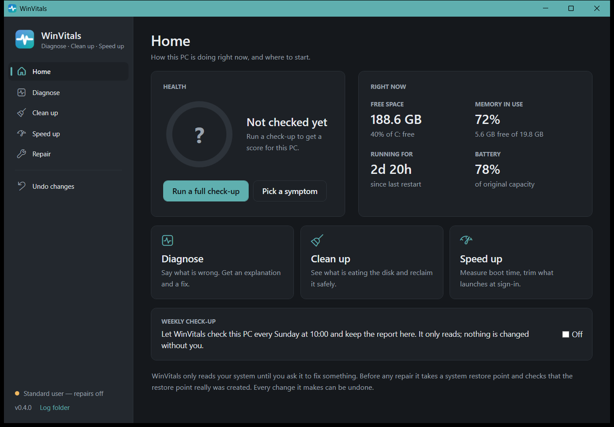

# WinVitals

Diagnose, clean up and speed up a Windows PC — written for people who are not technical.

<br clear="left" />

A check-up and repair tool for a Windows PC.

You tell it what is wrong in plain words — *"it won't sleep"*, *"my PC is slow"*, *"the
battery doesn't last"* — and it checks the right things, explains what it found, and
offers to fix it. Every repair shows you exactly what it will do before it does it, and
every repair can be undone.



**[Download `WinVitals.exe`](https://github.com/mark-alexander-hub/winvitals/releases/latest)**, run it, accept the prompt. There is nothing to install — one file, no .NET required.

---

## Why this exists

Everything needed to explain a misbehaving Windows PC is already on the machine. It is
just scattered across `powercfg`, Device Manager, the event log, WMI and a dozen
Settings pages, several of which need administrator rights and none of which talk to
each other.

So when a laptop wakes up in a bag, or fills its second drive on its own, the answer is
a forum thread telling you to run four commands and work out what the output means.

WinVitals runs those commands, joins them up, writes down what they mean, and then
offers to do something about it.

## What it checks

| Module | What it looks at |
|---|---|
| **System & Firmware** | Model, BIOS/UEFI version and date, Windows build, uptime, Fast Startup |
| **Startup speed** | How long the PC takes to boot from Windows' own measurements, how much of that is startup programs, and whether it is getting slower |
| **Power & Sleep** | Sleep states, what is blocking sleep right now, scheduled wake-ups, devices armed to wake, and whether sleep actually holds |
| **Storage** | Disk health and SMART, free space, TRIM, and which Windows features are eating the space |
| **Battery** | Real wear against design capacity, cycle count |
| **Memory** | Installed memory, slot arrangement, single-channel detection, current pressure, page file |
| **Devices & Drivers** | Every device Windows has flagged, with the error code translated |
| **Startup & Tasks** | What launches at sign-in, and which scheduled tasks are allowed to wake the machine |
| **Network** | Adapters and driver versions, DNS, and which ports are open to the network |
| **Security** | Antivirus, firewall per profile, BitLocker, shared folders, Remote Desktop |
| **Updates & Recovery** | Patch level, deferred restarts, and whether a usable restore point exists |
| **Crashes & Stability** | Blue screens, unexpected shutdowns, hardware errors, repeat app crashes, disk errors |

## What it can repair

Twenty-three repairs, each one showing its exact commands before it runs:

- **Speed up** — turn off animations and transparency, switch to the High performance
  power plan, stop Search indexing and SysMain thrashing a mechanical disk, and turn
  individual sign-in programs on and off — with the boot time measured before and after
- **Clean up** — delete temporary files, empty the Recycle Bin, reclaim the hibernation
  file, remove the previous Windows installation, clear the update sharing cache, clean
  up superseded update components, turn TRIM back on
- **Power** — restore sleep timeouts, stop scheduled wake-ups, stop the network adapter
  waking the machine, turn hibernate on
- **Security** — turn the firewall on, switch off Remote Desktop, update antivirus
  definitions, remove shares that expose a whole drive or user profile
- **Windows repair** — repair damaged system files (DISM then SFC, in that order and for
  a reason), reset the network stack, clear the DNS cache, clear the Windows Update cache

A **weekly check-up** can be switched on from the Home page: a scheduled task runs the
full scan every Sunday, keeps the report, and the dashboard shows the score.

## Four rules it follows

These are the reasons to use this rather than a "PC health" tool.

**1. It never says something is out of date unless it knows.**

WinVitals will not tell you a BIOS or driver is old. It reports the version and date it
found and links the vendor's own download page. Offline guesses about what is current
are wrong often enough to send people hunting for updates that do not exist, or to
"update" a driver to something older and generic. A 2022 driver is frequently the last
one the vendor ever shipped.

**2. It never confuses "I could not look" with "there is nothing there."**

Several checks — what is blocking sleep, disk SMART data, whether you have a restore
point — return access-denied to a standard user. A tool that swallows that error reports
a clean bill of health for a machine it never examined. Every check that could not run
says so, and the summary counts them separately.

**3. It takes a restore point, then checks that the restore point exists.**

Windows silently refuses to create a restore point if another was made in the last 24
hours: the call returns success and nothing is created. Every script that creates one
without verifying afterwards is lying to its user some of the time. WinVitals suspends
that throttle, creates the point, counts the restore points again, and tells you plainly
if it did not work — *before* changing anything, not after.

**4. Every change is reversible, and the record survives a reboot.**

Undo information is captured before a change is applied and written to disk immediately,
not held in memory. The cases where somebody needs to undo something are exactly the
cases where the machine has been restarted since. The Undo screen lists everything
WinVitals has ever changed on the machine, with a button to put each of it back.

Repairs that genuinely cannot be undone — deleting temporary files, emptying the Recycle
Bin — are marked as permanent and are never included in the one-click batch.

## Sharing a report

Reports end up pasted into forum threads and support tickets, so the Save Report button
offers to strip your username, PC name, hardware serial, MAC and IP addresses first. On
the command line that is `--redact`. It is a best-effort text filter rather than a
guarantee, and the report says so at the bottom.

## Command line

Running with any argument gives a read-only scan and an HTML report. Repairs are only
offered in the interface, where the consequences and the undo can be shown first.

```
WinVitals.exe                    open the interface
WinVitals.exe --check sleep      scan just the sleep checks, write a report
WinVitals.exe --redact           full scan, shareable report

--check <id>     Run one symptom check instead of everything
--out <path>     Where to write the HTML report (default: Desktop)
--json <path>    Also write the findings as JSON
--redact         Strip identifying details so the report is safe to share
--only <ids>     Run only these modules, comma separated
--skip <ids>     Run everything except these modules
--no-open        Do not open the report when finished
--scheduled      Write the report to WinVitals' own folder and leave a summary
                 for the dashboard (what the weekly task runs)
--gui            Force the interface
--run <id>       Open the interface straight into one check
```

Checks: `full slow sleep battery network crash space security`

Modules: `system power storage battery memory devices startup network security updates
reliability`

Exit codes: `0` nothing critical, `1` at least one critical finding, `2` bad arguments,
`3` could not write the report.

## Administrator rights

WinVitals always runs as administrator. Windows asks once when it starts; declining
simply does not start it.

It requires elevation because half of what it does is impossible without it: what is
holding the machine awake, what is scheduled to wake it, the drive's own failure
prediction, BitLocker status, whether any restore point exists — and every repair. A
version that ran unelevated would be a worse tool with a banner apologising for itself.

Debug builds are the one exception: they run as whoever launched them, so the interface
can be driven by automated tests without a UAC prompt per run. They say so in the
corner of the window.

## Signing

An unsigned build shows **"Unknown publisher"** on the UAC prompt and a SmartScreen
*"Windows protected your PC"* warning on first run. That is Windows doing its job:
nothing vouches for the file. Until releases are signed, click **More info → Run
anyway**, or install through winget, which does not trigger the warning.

Releases are being set up to be signed through **SignPath Foundation**, which
provides free code-signing certificates to open-source projects. The workflow step is
in place and activates once the project is approved; see [docs/signing.md](docs/signing.md)
for how it works and what was submitted. `./build.ps1 -Sign` remains available for
signing with a conventional `.pfx`, and the workflow also carries a dormant Azure
Trusted Signing step.

SmartScreen reputation is separate from the signature and is earned by downloads over
time.

## Building it yourself

Needs the [.NET 8 SDK](https://dotnet.microsoft.com/download/dotnet/8.0).

```
git clone https://github.com/mark-alexander-hub/winvitals
cd winvitals
./build.ps1
```

The single-file executable lands in `dist/WinVitals.exe`. It is self-contained, so it
runs on a machine with no .NET installed.

```
dotnet run --project src/WinVitals.App -- --no-elevate --no-open --out report.html
dotnet test tests/WinVitals.Tests
```

The parser tests are pinned against verbatim `powercfg` output captured from real
machines, tabs and all. These formats are undocumented and vary by sleep model, so they
are tested against reality rather than against what the documentation implies.

## Layout

```
src/WinVitals.Core/     collectors, the report writer, and the repair engine
  Collectors/           one file per module
  Remediation/          fixes, the undo journal, the restore-point guard
src/WinVitals.App/      the WPF interface and the command line
tests/WinVitals.Tests/  parser and redaction tests
```

## Adding a check

Implement `ICollector`, add it to the array in `AppInfo.cs`. Every finding carries four
things, and a pull request that omits any of them will be asked for it:

- **What** is literally true on this machine
- **Why** that matters, so the reader can decide whether to care
- **Action** — what to do, concretely, or nothing if there is nothing to do
- **Evidence** — the raw output the claim came from

The evidence requirement is the important one. WinVitals does not ask to be trusted; it
shows its working.

## Adding a repair

Implement `IFix`, add it to `FixCatalog`. The contract:

- Capture undo information *before* making the change
- Return it even on partial failure — a repair that got halfway still changed something
- Set `Reversible = false` honestly if it cannot be undone; the interface will keep it
  out of the one-click batch
- `Risk` decides whether it can be bundled or must be confirmed individually

## Contributing

Issues and pull requests welcome. Especially useful:

- Machines where a check reports something wrong — please attach a `--redact`ed report
- Hardware where WMI returns something unexpected (OEM firmware is endlessly creative)
- Checks or repairs that would have saved you an afternoon

## Licence

MIT. See [LICENSE](LICENSE).
